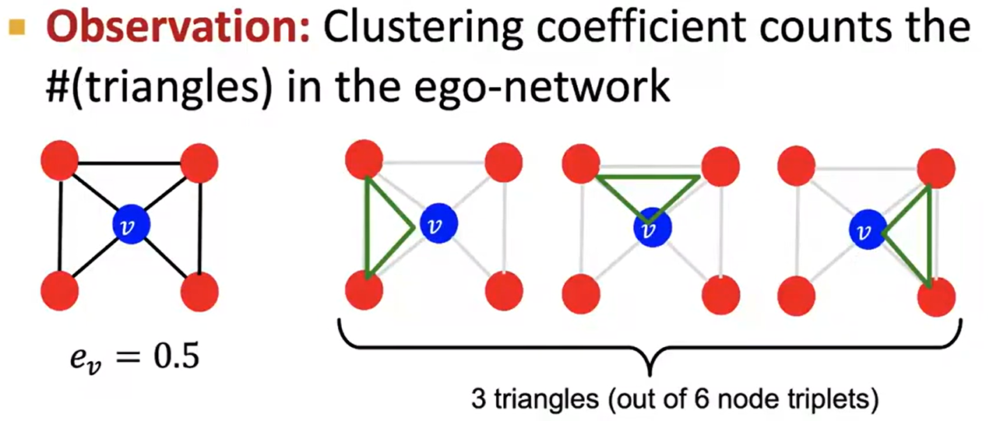

# Outline

## Tasks

# Leacture 1

**Node Degree**

**Bipartite graph**

**Floded/Projected Bipartitile Graphs**

**Connectivity**

# Lecture 2 Traditional Feature

## Node Feature Design
* Node-level prediction
* Link-level prediction
* Graph-level prediction

Focus on **undirected graphs**

**Goal** Characterize the structure and position of a node in the netword:

Two categories: **Importance-based features**(Node degrees, Different node Centrality measures) **Structure-based features**(Node degrees, Clustering coefficient, Graphlet count vector)
* Node degree
* Node centrality: takes the node **importance in a graph** into accout
    * **Eigenvector centrality**
    A node $v$ is important if surrounded by important neighboring nodes $u \in N(v)$.
    $$
    c_v = \frac{1}{\lambda}\sum_{\mu \in N(v)} c_\mu
    $$
    equals to
    $$
    \lambda c = Ac
    $$
    The largest eigenvalue $\lambda_{max}$ is always positive and unique.
    The leading eigenvector $c_{max}$ is used for centrality.
    一旦给出一个邻接矩阵A，就可以确定唯一一个$\lambda$和centrality vector $c$

    * **Betweenness centrality**
    A node is important if it lies on many shortest paths between other nodes.
    $$
    c_v = \sum_{s \neq v \neq t} \frac{\#(shortest\ path\ betwens\ s\ and t\ that\ contain\ v)}{\#(shortest\ paths\ between\ s\ and\ t)}
    $$
    用node在最短通路的数量来衡量node在graph中的重要程度

    * **Closeness centrality**
    $$
    c_v = \frac{1}{\sum_{u \neq v}shortest\ path\ length\ between\ u\ and\ v}
    $$
    用node到其他节点的容易程度来衡量
* Clustering coefficient
    
    **Observation** counts the traiangles(which are constructed by nodes including the current node) in the ego-netword
    
    如图所示，$C_2^4 = 6$所以包含当前节点在内可sudo update-alternatives --config x-www-browser
以构成6个三角形。因为多一个边，就是多了一个三角形的底边（包含当前节点构成三角形）。所以计算周围邻居点之间的边，和计算包含当前节点构成的三角形是一样的。
    衡量node链接区域的整体连通性

* Graphlets
    Rooted connected non-isomorphic
    
    * Degree counts edges that a node touches
    * Clustering coefficient counts triangles that a node touches
    * Graphlet Degree Vector(GDV) counts graphlets that a node touches
    **Graph Degree Vector (GDV)**: A count vector of graphlets rooted at a given node.
    
    rooted的意思是，当前节点作为结构中的根节点。一个结构可能有多个根节点，会产生多个rooted graph如上图中的c结构和d结构。

## Link Feature
**Task**

**Link-level Feature**
**Distance-based features**, **Local neighborhood overlap**, **Global neighborhood overlap**
* Shortest-path distance between two nodes

can not capture the degree of neighborhood overlap
无法捕捉到两个点之间是否有多条路径
改进**neighboring nodes shared between v1 and v2**

这种基于neighborhood的方法无法捕捉更远的信息

改进**Katz index**: count the number of paths of all lengths between a given pair of nodes
$$
S_{v_1 v_2} = \sum_{l=1}^{\infty}\beta^lA^l_{v_1 v_2}
$$

**Computing paths between two nodes**
$$
P^{(K)}_{uv} = \#paths\ of\ length\ K(direct neighborhood)
$$
$$
S = \sum_{i=1}^{\infty}\beta^iA^i=(I-\beta A)^{-1}-I
$$
proof:
Using the mathematical induction:
assume that $P^{(K-1)}_{uv} = \#paths\ of\ length\ K-1(direct neighborhood)$
$$
P^{(K)}_{uv} = P^{(K-1)}_{u:}A_{:v}\\
P^{(K)}_{uv} =\sum_{j}P^{(k-1)}_{uj}A_{jv}
$$
很容易看出$P^{(k)}=A^k$就是两点之间距离为k的路径的数量

## Graph Level Feature
* Kernel method

